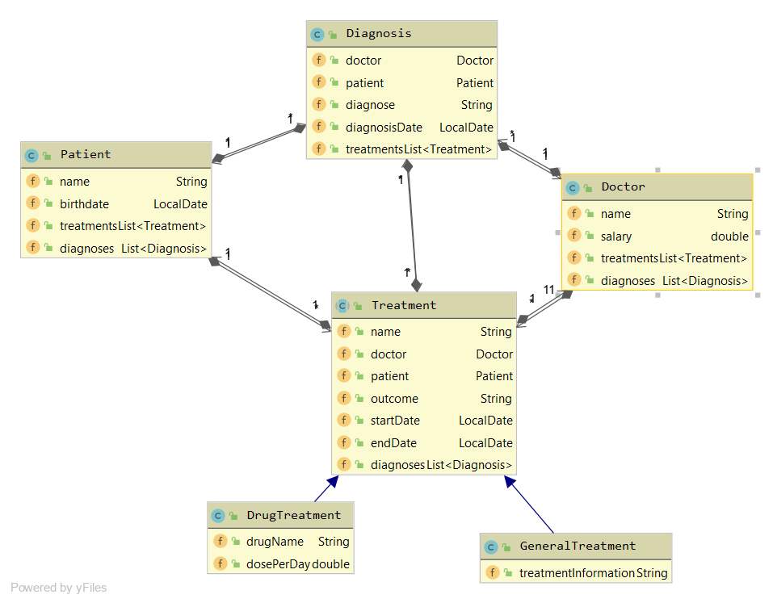
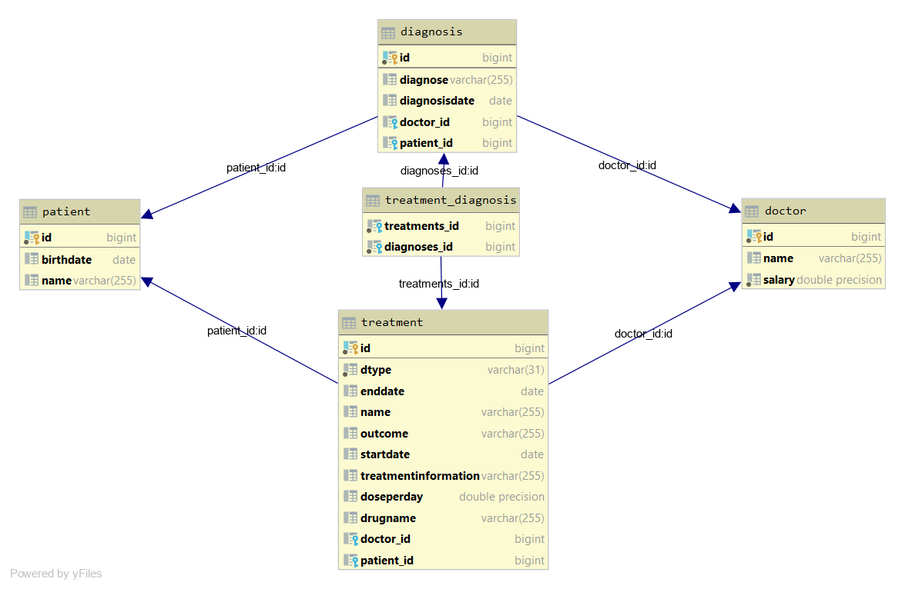

# 01-assignment-quarkus-jpa-stefnotch
[Open in browser](http://localhost:8080)

This school project manages a small aspect of a hospital. It manages the doctors, patients, diagnoses and treatments.

## CLD



## ERD



## Quarkus setup
https://code.quarkus.io/


By the way, `@Stateless` isn't a thing in Quarkus. 

[Source](https://stackoverflow.com/a/56656851)

## Database starting (PostgreSQL)
```
D:/opt/pgsql/bin/pg_ctl.exe --pgdata=db start
```
And kill it with CTRL+C 
Or use
```
D:/opt/pgsql/bin/pg_ctl.exe --pgdata=db stop
```

## Database setup (PostgreSQL)

Create a database
```
D:\opt\pgsql\bin\initdb.exe --auth=trust --pgdata=db
```

Add some stuff to your `pom.xml`
```xml
<!-- Database stuff -->
<!-- Hibernate ORM specific dependencies -->
<dependency>
  <groupId>io.quarkus</groupId>
  <artifactId>quarkus-hibernate-orm</artifactId>
</dependency>

<!-- JDBC driver dependencies -->
<dependency>
  <groupId>io.quarkus</groupId>
  <artifactId>quarkus-jdbc-postgresql</artifactId>
</dependency>
```

And configure the database `src/main/resources/application.properties`
```
# configure your datasource
quarkus.datasource.url = jdbc:postgresql://localhost:5432/postgres
quarkus.datasource.driver = org.postgresql.Driver

# drop and create the database at startup (use `update` to only update the schema)
quarkus.hibernate-orm.database.generation=drop-and-create
```
[Source](https://quarkus.io/guides/hibernate-orm-guide)

## OpenAPI / Swagger

```
"./mvnw" quarkus:add-extension -Dextensions="openapi"
```

Then open [localhost:8080/openapi](http://localhost:8080/openapi) in your browser to see the schema. 
If you want to check out the Swagger UI, open [localhost:8080/swagger-ui](http://localhost:8080/swagger-ui).
The Swagger UI is only visible in development mode.

Do note that it's currently buggy and ignores inherited stuff.

[Source](https://quarkus.io/guides/openapi-swaggerui-guide)

## Health Check

A simple way to check the "health" of your microservice. In other words, a page where you can see stuff like *is the database connection working*.
To check it out, open [localhost:8080/health](http://localhost:8080/health).

[Source](https://quarkus.io/guides/health-guide)

## Panache
JPA uses JDBC and abstracts everything away rather nicely. 
Panache is an abstraction on top of JPA which makes it even easier to implement the most common scenarios.
The most important things that Panache makes easier are
- Every `PanacheEntity` has an autogenerated ID by default.
- Every `PanacheEntity` comes with tons of useful methods by default such as `.list()`
- > Use public fields. Get rid of dumb getter and setters. Under the hood, we will generate all getters and setters that are missing, and rewrite every access to these fields to use the accessor methods. This way you can still write useful accessors when you need them, which will be used even though your entity users still use field accesses.
- DAOs or Repositories aren't needed anymore. Instead, the entity logic is in static methods in the entity classes.
- Writing queries is a whole lot easier.

However, as glorious as it might be, it's still in development and is lacking some features. For example, it doesn't have a [merge](https://github.com/quarkusio/quarkus/issues/3969) function.
Another thing to note is that I had to rework my AbstractEndpoint to a helper class, due to various Java language limitations with static methods and inheritance.

By the way, I'm not sure if this is a feature of Panache, but [Hibernate Bytecode Enhancements - Dirty Tracking](http://isd-soft.com/tech_blog/hibernate-bytecode-enhancement-dirty-tracking/) is turned on by default.
The test case in `/test/java/at/htl/QuarkusTests.java` verifies this. 

[Source](https://quarkus.io/guides/hibernate-orm-panache)

## CLD Settings
You can configure the default CLD settings in IntelliJ.


## AssertJ
It works alongside Junit5 and other testing frameworks. To use it after having added it to the `pom.xml`, add the following import.
```java
import static org.assertj.core.api.Assertions.*;
```

## Plugins
The following plugins are recommended
- Quarkus
- TabNine

## EntityGraph

Entities have references to other entities. e.g.
```java
@Entity
public class Diagnosis extends PanacheEntity {
    @ManyToOne
    public Doctor doctor;
}
```
By default, a `@ManyToOne` relationship is eagerly fetched. Meaning, it's fetched when you fetch the diagnosis.
However, this is not always desireable. And always setting it to lazy is also rather inconvenient.
So, entity graphs were invented and they let you specify which things to load and which ones to ignore.

So, entity graphs are a rather recent addition to Quarkus. [Tracking issue](https://github.com/quarkusio/quarkus/issues/3483)
This project uses an old Quarkus version and I can't trivially update it, because they did some backwards incompatible changes.
For example, they [turned off the Hibernate bytecode enhancements](https://quarkus.io/blog/quarkus-1-3-0-final-released/).

## Feedback - 1 
> - [x] im Gegensatz zu den meisten Deiner Kollegen eine umfangreiche Doku
> - [ ] es fehlt ...
>   - ein CLD und ein ERD
>   - eine kurze Erläuterung Deines Datenmodells
> - [x] postegres lokal zu installieren ist wahrscheinlich nicht optimal → besser [docker siehe Schwarzc](https://github.com/1920-5bhif-nvs/01-assignment-quarkus-jpa-ZekReshi)
> - [ ] Alle Beziehungen bidirektional zu gestalten,kann problematisch sein. 
> Im  vorliegenden  Bsp  fehlen  add-Methoden  und  es  werden  die  bidirektionalen  Assoziationennicht korrekt gesetzt (bei CRUD-Operationen)
> - [ ] Es sind nicht alle Tabellen mit Testdaten befüllt und dann nur 1 Datensatz
> - [ ] Endpoints und DAOs vom Umfang her extrem minimal
> - [ ] RestConfig ist in Quarkus nicht notwendig
> - [ ] Der Swagger zeigt nur einen Endpoint an http://localhost:8080/swagger-ui
> - [ ] Es gibt keinerlei Unittests, weder für DB noch für Endpoints

### Responses - Not sure
> - [ ] Endpoints und DAOs vom Umfang her extrem minimal

Alle CRUD Operationen sind im AbstractEndpoint implementiert, von welchem alle anderen Endpoints ableiten.

> - [ ] Der Swagger zeigt nur einen Endpoint an http://localhost:8080/swagger-ui

"Do note that it's currently buggy and ignores inherited stuff."
This bug seems to have been fixed in the latest Quarkus version!


> - [ ] Es gibt keinerlei Unittests, weder für DB noch für Endpoints

War meines Wissens bei der Uebung 01 nicht gefordert. Die [Uebung 02](https://github.com/1920-5bhif-nvs/02-microservices-individual-tasks-stefnotch/blob/master/krankenhaus-test/src/test/java/at/htl/ExampleResourceTest.java) hat Unit Tests fuer die REST Schnittstelle.


### Responses - Fixed

> - [ ] es fehlt ...
>   - ein CLD und ein ERD
>   - eine kurze Erläuterung Deines Datenmodells
> - [ ] Alle Beziehungen bidirektional zu gestalten,kann problematisch sein. 
> Im  vorliegenden  Bsp  fehlen  add-Methoden  und  es  werden  die  bidirektionalen  Assoziationennicht korrekt gesetzt (bei CRUD-Operationen)
> - [ ] Es sind nicht alle Tabellen mit Testdaten befüllt und dann nur 1 Datensatz

Ich habe diese Probleme soeben behoben und auch gleich Panache ausprobiert. Mit Panache sind die bidirektionalen Beziehungen auch kein Problem mehr (siehe oben).

> - [ ] RestConfig ist in Quarkus nicht notwendig

War mir nicht bewusst, danke fuer die Information.
